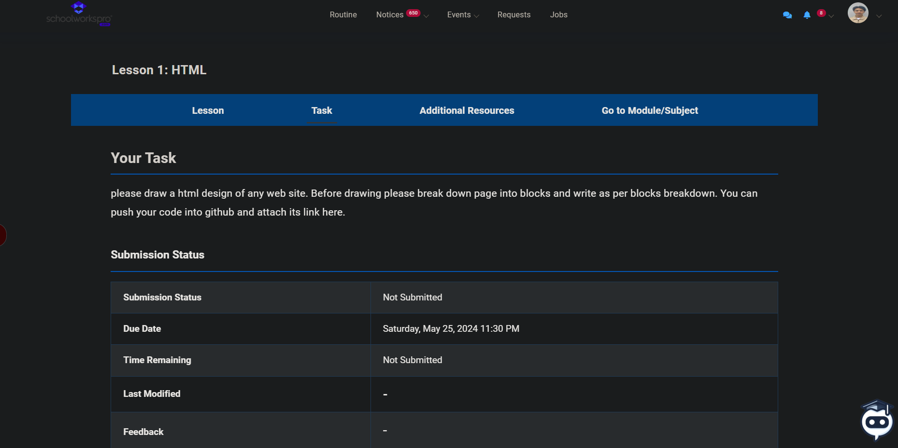

# HTML Design - Task 1

## Table of contents

- [Overview](#overview)
  - [Screenshot](#screenshot)
- [My process](#my-process)
  - [Built with](#built-with)
  - [What I learned](#what-i-learned)
- [Author](#author)

## Overview
A simple age calculator which calculates the interval between the input date and current date.

### Screenshot

## My process
 -Took the screenshot of reference image
 - Divided the page in blocks 
 - Named unique names for main divs
 - Used table tag to design talbe 

### Built with

- Semantic HTML5 markup

### What I learned
Patience

## Author

- Github - [@Pin3appl3ishan](https://github.com/Pin3appl3ishan)
- Frontend Mentor - [@Pin3appl3ishan](https://www.frontendmentor.io/profile/yourusername)

